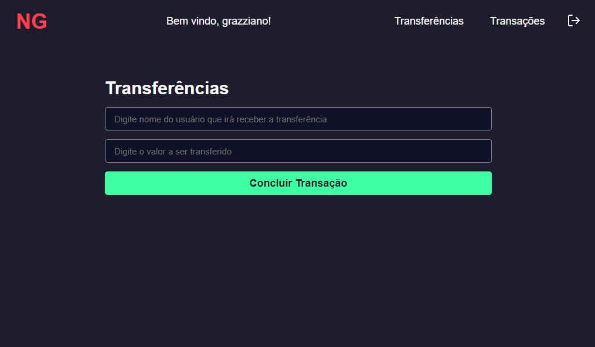
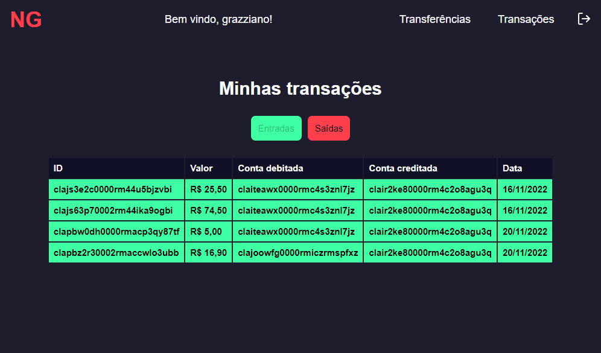
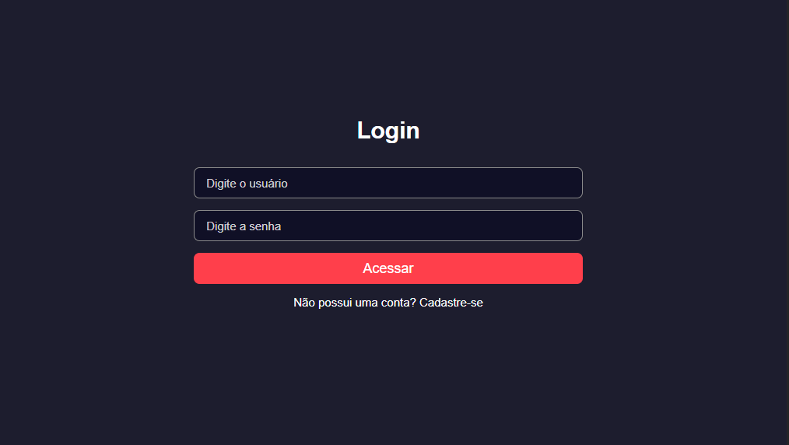
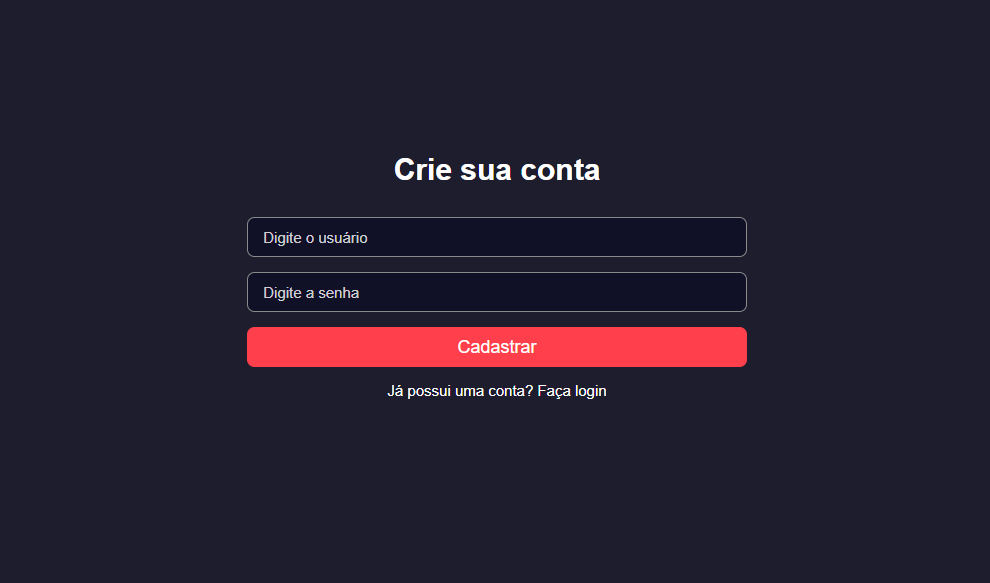
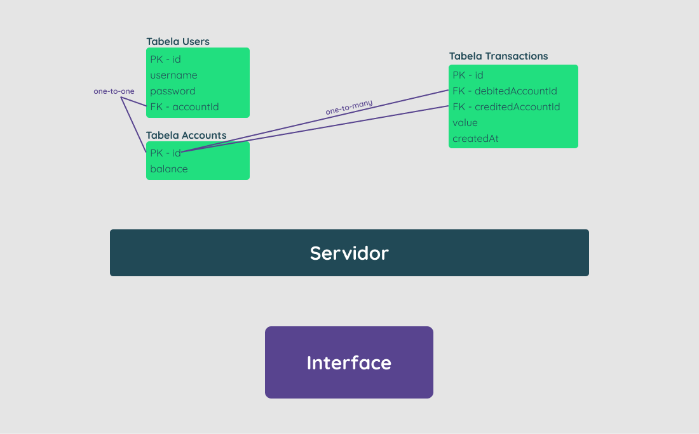

  <h1>Carteira Digital</h1>

  
  
  
  

Esta aplicação web fullstack, possibilita que usuários consigam realizar transferências internas entre si.

## ✔️ Técnicas e tecnologias utilizadas

Lista de tecnologias que foram usadas nesse projeto:

 

### Frontend

### Backend

## 🪛 Funcionalidades

Frontend

- Página para realizar o cadastro na NG informando username e password.

- Página para realizar o login informando username e password.

- Com o usuário logado, a página principal deve apresentar:

  - balance atual do usuário;

  - Seção voltada à realização de transferências para outros usuários NG a partir do username de quem sofrerá o cash-in;

  - Tabela com os detalhes de todas as transações que o usuário participou;

  - Mecanismo para filtrar a tabela por data de transação e/ou transações do tipo cash-in/cash-out;

  - Botão para realizar o log-out.
  

 

Backend

- Qualquer pessoa deverá poder fazer parte da NG. Para isso, basta realizar o cadastro informando username e password.

- Deve-se garantir que cada username seja único e composto por, pelo menos, 3 caracteres.

- Deve-se garantir que a password seja composta por pelo menos 8 caracteres, um número e uma letra maiúscula. Lembre-se que ela deverá ser hashada ao ser armazenada no banco.

- Durante o processo de cadastro de um novo usuário, sua respectiva conta deverá ser criada automaticamente na tabela Accounts com um balance de R$ 100,00. É importante ressaltar que caso ocorra algum problema e o usuário não seja criado, a tabela Accounts não deverá ser afetada.

- Todo usuário deverá conseguir logar na aplicação informando username e password. Caso o login seja bem-sucedido, um token JWT (com 24h de validade) deverá ser fornecido.

- Todo usuário logado (ou seja, que apresente um token válido) deverá ser capaz de visualizar seu próprio balance atual. Um usuário A não pode visualizar o balance de um usuário B, por exemplo.

- Todo usuário logado (ou seja, que apresente um token válido) deverá ser capaz de realizar um cash-out informando o username do usuário que sofrerá o cash-in), caso apresente balance suficiente para isso. Atente-se ao fato de que um usuário não deverá ter a possibilidade de realizar uma transferência para si mesmo.

- Toda nova transação bem-sucedida deverá ser registrada na tabela Transactions. Em casos de falhas transacionais, a tabela Transactions não deverá ser afetada.

- Todo usuário logado (ou seja, que apresente um token válido) deverá ser capaz de visualizar as transações financeiras (cash-out e cash-in) que participou. Caso o usuário não tenha participado de uma determinada transação, ele nunca poderá ter acesso à ela.

- Todo usuário logado (ou seja, que apresente um token válido) deverá ser capaz de filtrar as transações financeiras que participou por:

  - Data de realização da transação e/ou

        - Transações de cash-out;

        - Transações de cash-in.

 

## ⚙️ Arquitetura

  

## 🛠️ Abrir e rodar o projeto

### Frontend

Para abrir e rodar o projeto, entre na pasta web do frontend execute `npm install` para instalar as dependências e `npm run dev` para iniciar o projeto.

Depois, acesse <a href="http://localhost:3000/">http://localhost:3000/</a> no seu navegador.

### Backend

Para subir o backend primeiro é necessário criar um banco de dados na sua máquina e renomear o arquivo `.env.example` para `.env`, então colocar as informação do banco criado conforme o exemplo na variável de ambiente `DATABASE_URL`.

Na variável de ambiente `JWT_SECRET` coloque a palavra secreta que será usada para validar o token.

Depois entre na pasta server do backend e execute `npm install` para instalar as dependências e `npm run dev` para iniciar o projeto.

O servidor ficará disponível no endereço <a href="http://localhost:3333/">http://localhost:3333/</a>.

## 📚 Mais informações

Entre em contato pelo [linkedin](https://www.linkedin.com/in/grazziano-fagundes/).

  <small>Grazziano Borges Fagundes - 2022</small>

